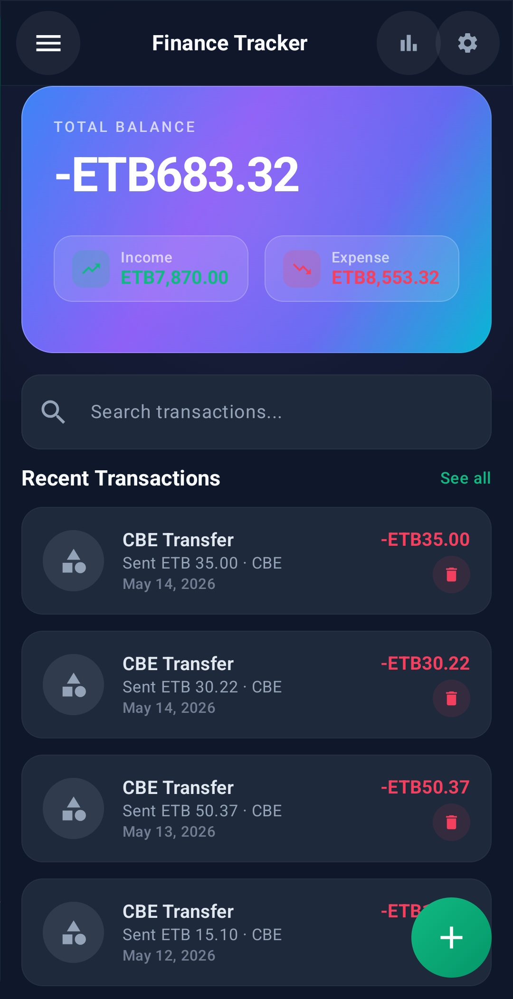
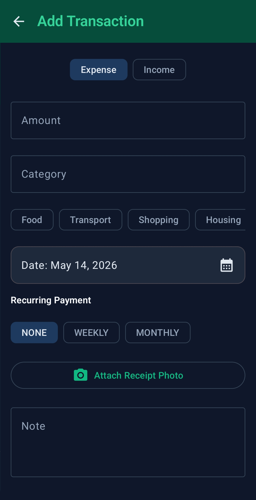
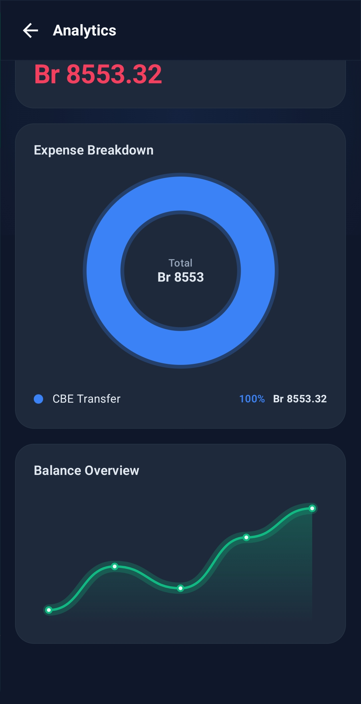
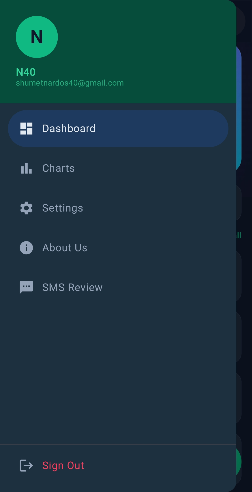
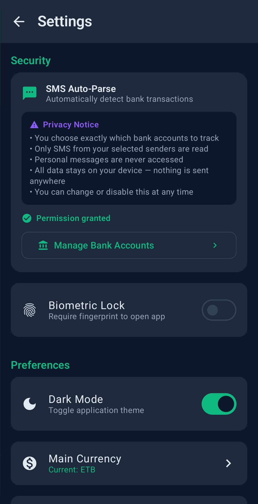

# 💰 Personal Finance Tracker

A production-ready Android application built with **Kotlin** and **Jetpack Compose**, designed to automatically track Ethiopian bank transactions via SMS, provide AI-powered financial insights, and give users full control over their money — all stored locally on-device.

This project serves as a showcase of modern Android development patterns, including **Clean Architecture**, **Dependency Injection**, and **Reactive UI**.

---

## 🚀 Features

### 🔐 Authentication & Security
- **Firebase Authentication** — email/password sign-in and registration with session persistence
- **Biometric Lock** — fingerprint/face authentication with first-time setup prompt
- **Real-time Input Validation** — per-field error messages, password strength indicator (5-segment bar + rule checklist)
- **Forgot Password** — Firebase reset email with bilingual (English/Amharic) template
- **Onboarding Flow** — 3-page introduction for first-time users

### 📊 Dashboard
- **Hero Balance Card** — mesh gradient (Blue → Purple → Indigo → Teal), animated budget progress bar
- **Income / Expense Summary** — frosted glass pills with trend icons
- **Bank Accounts Section** — per-bank balance cards directly on the dashboard
- **Paged Transaction List** — infinite scroll via Paging 3, stable keys, enter animations
- **Real-time Search** — instant "as-you-type" filtering by category or note
- **Glassmorphism UI** — semi-transparent cards, subtle white borders, midnight dark theme

### 💳 Transaction Management
- **Manual Entry** — amount, category, type, date, note, receipt photo
- **Receipt Photos** — copied to app-private storage immediately on pick (survives restarts)
- **Recurring Transactions** — NONE / WEEKLY / MONTHLY
- **Category Chips** — quick-select suggestions per transaction type
- **Edit & Delete** — full edit form with delete confirmation dialog
- **Offline First** — Fully functional offline storage using the Room Persistence Library.

### 📱 SMS Auto-Parse *(Ethiopian Banks)*
- **Real-time Interception** — `SmsBroadcastReceiver` → `WorkManager` → `SmsProcessWorker`
- **Body-based Bank Detection** — detects bank from SMS content, not sender name (fixes false positives)
- **Supported Banks:**

| Bank | Credit keyword | Debit keyword |
|---|---|---|
| CBE | `credited with ETB` | `debited with ETB` |
| Dashen | `Credit of ETB` | `Debit of ETB` |
| Telebirr | `You have received ETB` | `You have sent/paid ETB` |
| Awash | `Credited ETB` | `Debited ETB` |
| Abyssinia | `Cr ETB` | `Dr ETB` |

- **Strategy Pattern** — each bank is an independent, testable parser class
- **Dynamic Banks** — user can add custom banks with their own keywords
- **SHA-256 Deduplication** — two-layer protection (app-level + unique DB index with `IGNORE`)
- **Historical Sync** — backfills up to 200 messages per sender from device inbox
- **Timestamp Extraction** — reads actual transaction time from SMS body (EAT UTC+3), falls back to receive time
- **Safe Amount Parsing** — strips negatives/commas/currency prefixes, rejects zero/malformed values
- **Notification Listener Fallback** — `SmsNotificationListenerService` for devices without SMS permission

### ✅ Pending Review Screen
- All SMS-parsed transactions require user confirmation before affecting balance
- **Confirm** / **Edit** / **Dismiss** / **Confirm All** actions
- Expandable raw SMS body for audit
- Sync progress indicator (WorkManager `LiveData`)
- Badge count on navigation drawer

### 🏦 Bank Account Management
- Per-bank balance tracking updated on each confirmed SMS transaction
- `bankName` stored directly on each transaction (fixes CBE/BOA merge bug)
- Custom bank configurations stored in `custom_bank_table`
- Bank account cards on dashboard with last-known balance

### � Budget Planner & Per-Category Alerts *(Added: May 19–21, 2026)*
- **Per-category budget limits** — set individual spending caps for Food, Transport, Shopping, Housing, Utilities, and more via `CategoryBudget` model and `category_budget_table`
- **Smart budget alerts** — `BudgetAlertWorker` fires at **80%**, **90%**, and **100%+** of each category's limit, not just the overall monthly limit
- **Enhanced Monthly Goals screen** — redesigned UI with category-level budget cards, progress bars per category, and visual color coding (green → amber → red)
- **Real-time budget tracking** — `MonthlyGoalsViewModel` combines overall goal + per-category budgets into a single reactive state
- **Persistent category budgets** — stored in Room `category_budget_table`, survives app restarts

### �📅 Calendar & Reminders
- Create financial reminders: deposits, withdrawals, rent, utilities, subscriptions
- Recurring reminders (WEEKLY / MONTHLY)
- Auto-generate transactions from reminders when due
- Reminder notifications with "Mark as Paid" action
- Sync to system calendar option

### 🤖 AI-Powered Insights *(Groq API)*
- Spending analysis: daily average, predicted burn rate, budget usage
- Category-wise breakdown with alerts
- Weekly spending trends
- AI chat interface for financial questions
- Human-readable insight cards with priority levels

### 📈 Analytics
- **Animated Pie Chart** — category expense breakdown with draw-on animation
- **Smooth Line Chart** — cubic Bezier curves, glowing gradient fill, left-to-right reveal
- **Glowing Donut Chart** — per-arc glow layer, `StrokeCap.Round`

### 🔔 Notifications & Background Workers
| Worker | Schedule | Purpose |
|---|---|---|
| `BudgetAlertWorker` | Every 12 hours | Alerts at 80%, 90%, 100%+ of expense limit |
| `WeeklyReportWorker` | Sunday 6 PM | Weekly spending summary notification |
| `ReminderWorker` | Every 1 hour | Triggers due reminders, auto-generates transactions |
| `SmsProcessWorker` | On SMS receive | Parses + inserts single SMS transaction |
| `SmsHistorySyncWorker` | On-demand | Backfills historical SMS from inbox |

### 🌍 Localization & Preferences
- **Languages** — English and Amharic (runtime switching)
- **Currencies** — ETB, USD, EUR, GBP, JPY, CAD, AUD
- **Theme** — Dark / Light / System default
- **Biometric** — enable/disable per-session lock
- **Fully externalized strings** — all UI text moved to `strings.xml` / `strings-am.xml` for complete localization coverage *(May 21, 2026)*

### 📤 Data Export
- Export all transactions to CSV file via system file picker

---

## 🛠 Tech Stack

| Category | Technology |
|---|---|
| Language | [Kotlin](https://kotlinlang.org/) |
| UI Framework | [Jetpack Compose](https://developer.android.com/jetpack/compose) (Material 3) |
| Architecture | MVVM + Clean Architecture |
| DI | [Dagger-Hilt](https://dagger.dev/hilt/) |
| Database | [Room](https://developer.android.com/training/data-storage/room) v8 |
| Preferences | [Jetpack DataStore](https://developer.android.com/topic/libraries/architecture/datastore) |
| Auth | Firebase Authentication |
| AI | Groq API (via Retrofit) |
| Background | [WorkManager](https://developer.android.com/topic/libraries/architecture/workmanager) (Hilt-injected) |
| Pagination | [Paging 3](https://developer.android.com/topic/libraries/architecture/paging/v3-paged-data) |
| Image Loading | [Coil](https://coil-kt.github.io/coil/) |
| Async | [Kotlin Coroutines](https://kotlinlang.org/docs/coroutines-overview.html) + [Flow](https://kotlinlang.org/docs/flow.html) |
| Navigation | [Jetpack Compose Navigation](https://developer.android.com/jetpack/compose/navigation) |
| Security | AndroidX Biometric API |
| Dependency Management | Gradle Version Catalog (`libs.versions.toml`) |
| Code Generation | KSP (Kotlin Symbol Processing) |

---

## 🏗 Architecture

The app follows **Clean Architecture** principles to ensure scalability, maintainability, and testability. It is divided into three main layers:

1.  **Data Layer**: Handles data persistence (Room) and remote communication (Retrofit/Firebase). Includes Mappers to convert between Database Entities/API Responses and Domain Models.
2.  **Domain Layer**: The core business logic. Contains pure Kotlin Models, Repository Interfaces, and **Use Cases (Interactors)** for specific business rules.
3.  **UI Layer**: Jetpack Compose screens that observe **UI State (StateFlow)** from ViewModels. ViewModels interact only with Use Cases, keeping them decoupled from data implementation details.

### Project Structure
```
app/
├── core/
│   ├── sms/                    ← SMS parsing (Strategy Pattern)
│   │   ├── BankSmsParser.kt    ← interface + factory
│   │   ├── ParseResult.kt      ← sealed result type
│   │   ├── SmsParser.kt        ← format detection + routing
│   │   ├── SmsInboxReader.kt   ← historical inbox reader
│   │   ├── SmsBroadcastReceiver.kt
│   │   └── parsers/            ← one file per bank
│   ├── worker/                 ← WorkManager workers
│   ├── receiver/               ← BroadcastReceivers
│   └── util/                   ← AmountParser, SmsTimestampParser, etc.
├── data/
│   ├── local/                  ← Room entities, DAOs, migrations
│   ├── remote/                 ← Groq API (Retrofit)
│   ├── repository/             ← Repository implementations
│   └── mapper/                 ← Entity ↔ Domain mappers
├── domain/
│   ├── model/                  ← Pure Kotlin domain models
│   ├── repository/             ← Repository interfaces
│   └── use_case/               ← Business logic use cases
├── ui/
│   ├── auth/                   ← Login, biometric setup
│   ├── dashboard/              ← Dashboard, summary card, transaction item
│   ├── transaction/            ← Add/edit transaction
│   ├── charts/                 ← Charts screen + components
│   ├── insights/               ← AI insights + chat
│   ├── sms/                    ← Pending review, account setup
│   ├── settings/               ← Settings, goals, about
│   ├── calendar/               ← Calendar + reminders
│   ├── navigation/             ← NavGraph, AppDrawer, Screen routes
│   ├── splash/                 ← Animated splash screen
│   ├── onboarding/             ← Onboarding pages
│   ├── components/             ← GlassCard, reusable composables
│   └── theme/                  ← Color, Typography, Theme
└── di/                         ← Hilt modules
```

---

## 🗄 Database Schema (v8)

### `transaction_table`
| Column | Type | Description |
|---|---|---|
| `id` | INT PK | Auto-generated |
| `amount` | DOUBLE | Always positive |
| `category` | TEXT | e.g. `"CBE Transfer"` |
| `date` | LONG | Actual transaction time (ms) |
| `type` | TEXT | `INCOME` / `EXPENSE` |
| `note` | TEXT | User note |
| `receiptPath` | TEXT? | Local file path |
| `recurringPeriod` | TEXT | `NONE` / `WEEKLY` / `MONTHLY` |
| `source` | TEXT | `MANUAL` / `SMS` |
| `rawSms` | TEXT? | Original SMS body (audit) |
| `smsBalance` | REAL? | Running balance from SMS |
| `smsHash` | TEXT? unique | SHA-256 dedup key |
| `smsId` | TEXT? | Content Provider `_id` |
| `isPending` | BOOLEAN | Awaiting user confirmation |
| `bankName` | TEXT? | Exact bank name (e.g. `"CBE"`, `"Abyssinia"`) |

**Indexes:** `date`, `category`, `type`, `source`, `smsHash` (unique)

### `monthly_goal_table`
| Column | Type | Description |
|---|---|---|
| `monthYear` | TEXT PK | `"MM-yyyy"` |
| `incomeGoal` | DOUBLE | Target income |
| `expenseLimit` | DOUBLE | Spending limit |

### `bank_account_table`
| Column | Type | Description |
|---|---|---|
| `id` | INT PK | Auto-generated |
| `bankName` | TEXT unique | e.g. `"CBE"` |
| `senderAddress` | TEXT | SMS sender address |
| `lastKnownBalance` | REAL | Balance from last confirmed SMS |
| `lastUpdated` | LONG | Timestamp of last update |
| `totalTransactions` | INT | Count of confirmed transactions |
| `colorHex` | TEXT | UI accent color |

### `custom_bank_table`
| Column | Type | Description |
|---|---|---|
| `id` | INT PK | Auto-generated |
| `name` | TEXT | Bank display name |
| `senderAddress` | TEXT | SMS sender to match |
| `creditKeyword` | TEXT | e.g. `"credited with ETB"` |
| `debitKeyword` | TEXT | e.g. `"debited with ETB"` |
| `balanceKeyword` | TEXT | e.g. `"Available balance"` |
| `isEnabled` | BOOLEAN | Active/inactive |
| `colorHex` | TEXT | UI accent color |

### `reminder_table`
| Column | Type | Description |
|---|---|---|
| `id` | INT PK | Auto-generated |
| `title` | TEXT | Reminder label |
| `amount` | DOUBLE | Expected amount |
| `date` | LONG | Due timestamp |
| `type` | TEXT | `DEPOSIT` / `WITHDRAW` / `RENT` / `UTILITY` / `SUBSCRIPTION` |
| `category` | TEXT | Category label |
| `isCompleted` | BOOLEAN | Marked as done |
| `repeatInterval` | TEXT | `NONE` / `WEEKLY` / `MONTHLY` |
| `autoGenerateExpense` | BOOLEAN | Auto-create transaction when due |
| `syncToGoogleCalendar` | BOOLEAN | Sync to system calendar |

### DataStore Preferences (`settings`)
| Key | Type | Default | Purpose |
|---|---|---|---|
| `biometric_enabled` | Boolean | `false` | Fingerprint lock |
| `is_first_time_user` | Boolean | `true` | Biometric setup shown once |
| `is_onboarded` | Boolean | `false` | Onboarding completed |
| `is_dark_mode` | Boolean? | `null` | Theme override |
| `currency_code` | String | `"ETB"` | Display currency |
| `language_code` | String | `"en"` | App language |
| `user_uid` | String | `""` | Firebase UID |
| `user_email` | String | `""` | Cached email |
| `user_name` | String | `""` | Cached username |
| `is_logged_in` | Boolean | `false` | Session state |
| `tracked_sms_senders` | String | `""` | Comma-separated sender addresses |
| `sms_tracking_enabled` | Boolean | `false` | SMS auto-parse on/off |

---

## 📱 Navigation Routes

| Route | Screen |
|---|---|
| `login_screen` | Login / Register |
| `dashboard_screen` | Main dashboard |
| `add_edit_transaction_screen` | Add / Edit transaction |
| `charts_screen` | Spending analytics |
| `settings_screen` | App settings |
| `monthly_goals_screen` | Monthly goals |
| `about_us_screen` | About |
| `pending_review_screen` | SMS pending review |
| `sms_account_setup_screen` | Bank account setup |
| `calendar_screen` | Calendar & reminders |
| `insights_screen` | AI insights & chat |
| `transactions_screen` | Full transaction list |

---

## 🔐 Permissions

```xml
<uses-permission android:name="android.permission.POST_NOTIFICATIONS" />
<uses-permission android:name="android.permission.INTERNET" />
<uses-permission android:name="android.permission.RECEIVE_SMS" />
<uses-permission android:name="android.permission.READ_SMS" />
```

---

## 🛠 Installation

1. Clone the repository:
   ```bash
   git clone https://github.com/yourusername/personal-finance-tracker.git
   ```
2. Open in **Android Studio Hedgehog** or newer.
3. Add `google-services.json` from Firebase Console → `app/` folder.
4. Enable **Email/Password** sign-in in Firebase Console → Authentication → Sign-in method.
5. *(Optional)* Add your Groq API key to enable AI insights.
6. Sync Gradle and run on a device or emulator (API 26+).

> **Notes:**
> - Biometric features require a physical device or emulator with fingerprint support.
> - SMS Auto-Parse requires a physical device with a SIM receiving bank notifications.
> - AI Insights require an active internet connection and a valid Groq API key.

---

## 📸 Screenshots

<p align="center">
  
  
  
  
  
</p>

---

