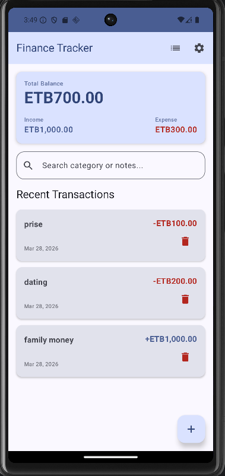
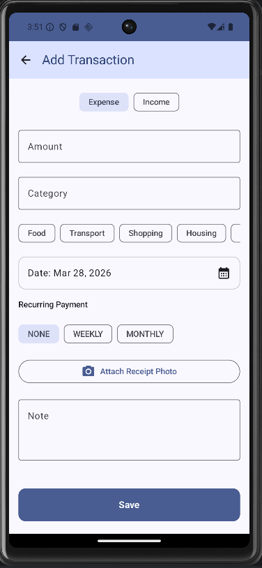

# 💰 Personal Finance Tracker

A modern, robust Android application built with **Kotlin** and **Jetpack Compose**, designed to help users track their daily income and expenses with ease. This project serves as a showcase of mid-to-senior level Android development patterns, including **Clean Architecture**, **Dependency Injection**, **Reactive UI**, and **Localization**.

## 🚀 Features

- **Intuitive Dashboard**: Real-time summary of total balance, income, and expenses.
- **Transaction Management**: Easily add, view, and delete transactions with categories, notes, receipt photos, and dates.
- **Advanced Search & Filter**: Instant, "as-you-type" filtering of transactions by category or notes.
- **Visual Analytics**: Beautiful, animated **Native Canvas Pie Charts** for expense breakdown by category.
- **Biometric Security**: Secure your financial data with fingerprint authentication lock.
- **Multilingual Support**: Fully localized in English and Amharic, with seamless runtime language switching using Jetpack DataStore.
- **User Preferences**: Dark/Light mode toggle, customizable main currency, and monthly goal setting.
- **Data Export**: Export all your transaction history securely to a local CSV file.
- **Offline First**: Fully functional offline storage using the Room Persistence Library.

## 🛠 Tech Stack

- **Language**: [Kotlin](https://kotlinlang.org/)
- **UI Framework**: [Jetpack Compose](https://developer.android.com/jetpack/compose) (Material 3)
- **Architecture**: MVVM (Model-View-ViewModel) + Clean Architecture
- **Dependency Injection**: [Dagger-Hilt](https://dagger.dev/hilt/)
- **Local Data & Preferences**: [Room](https://developer.android.com/training/data-storage/room) & [Jetpack DataStore](https://developer.android.com/topic/libraries/architecture/datastore)
- **Security**: [AndroidX Biometric API](https://developer.android.com/training/sign-in/biometric-auth)
- **Asynchronous Programming**: [Kotlin Coroutines](https://kotlinlang.org/docs/coroutines-overview.html) & [Flow](https://kotlinlang.org/docs/flow.html)
- **Navigation**: [Jetpack Compose Navigation](https://developer.android.com/jetpack/compose/navigation)
- **Dependency Management**: Gradle Version Catalog (`libs.versions.toml`)

## 🏗 Architecture Overview

The app follows **Clean Architecture** principles to ensure scalability, maintainability, and testability. It is divided into three main layers:

1.  **Data Layer**: Handles data persistence (Room) and preferences (DataStore). Provides implementation for repositories and Mappers to convert between Database Entities and Domain Models.
2.  **Domain Layer**: The core business logic. Contains pure Kotlin Models, Repository Interfaces, and **Use Cases (Interactors)** for specific business rules.
3.  **UI Layer**: Jetpack Compose screens that observe **UI State (StateFlow)** from ViewModels. ViewModels interact only with Use Cases, keeping them decoupled from data implementation details.

## � Database Architecture

The app uses **two local storage systems** — no internet or backend required. All data lives on the user's device.

---

### 1. Room Database (`finance_db`) — SQLite

[Room](https://developer.android.com/training/data-storage/room) is Android's official SQLite wrapper. It stores all financial records persistently across app restarts.

**Current schema version: 3**

#### Tables

**`transaction_table`**

| Column | Type | Description |
|---|---|---|
| `id` | INT (PK, auto) | Unique transaction ID |
| `amount` | DOUBLE | Transaction amount |
| `category` | TEXT | e.g. `"food"`, `"salary"` |
| `date` | LONG | Unix timestamp (ms) |
| `type` | TEXT | `"INCOME"` or `"EXPENSE"` |
| `note` | TEXT | User note / description |
| `receiptPath` | TEXT (nullable) | Local path to receipt image |
| `recurringPeriod` | TEXT | `"NONE"`, `"WEEKLY"`, `"MONTHLY"` |

**`monthly_goal_table`**

| Column | Type | Description |
|---|---|---|
| `monthYear` | TEXT (PK) | Format: `"MM-yyyy"` e.g. `"05-2026"` |
| `incomeGoal` | DOUBLE | Target income for the month |
| `expenseLimit` | DOUBLE | Spending limit for the month |

---

### 2. DataStore Preferences (`settings`)

[Jetpack DataStore](https://developer.android.com/topic/libraries/architecture/datastore) stores lightweight user preferences as key-value pairs (replaces SharedPreferences).

| Key | Type | Default | Purpose |
|---|---|---|---|
| `biometric_enabled` | Boolean | `false` | Fingerprint lock on/off |
| `is_first_time_user` | Boolean | `true` | Show biometric setup once |
| `is_onboarded` | Boolean | `false` | Show onboarding screens |
| `is_dark_mode` | Boolean? | `null` | Theme override (`null` = follow system) |
| `currency_code` | String | `"ETB"` | Display currency |
| `language_code` | String | `"en"` | App language |

---

### How Data Flows

```
UI (Composable)
      ↕  observes StateFlow
  ViewModel
      ↕  calls
  Use Case  ←  validates business rules
      ↕  calls
  Repository Interface
      ↕  implemented by
  RepositoryImpl
      ↕  calls
  DAO (SQL queries)
      ↕
  Room / SQLite  →  finance_db on device storage
```

Data is read as `Flow<List<...>>` from the DAO, meaning the UI **automatically recomposes** whenever the database changes — no manual refresh needed.

#### Example — saving a transaction

```kotlin
// 1. UseCase validates the input
if (transaction.amount <= 0.0) throw InvalidTransactionException("Amount must be > 0")

// 2. Repository converts domain model → database entity and writes it
dao.insertTransaction(transaction.toEntityModel())

// 3. The Flow in the DAO emits the updated list automatically
// 4. ViewModel collects it → UI recomposes
```

---

### Storage Summary

```
Device Storage
├── finance_db  (SQLite / Room)
│   ├── transaction_table
│   └── monthly_goal_table
└── settings    (DataStore Preferences)
    ├── dark_mode, currency, language
    └── biometric, onboarding flags
```

> **Note:** The database uses `fallbackToDestructiveMigration()`, which means a schema version bump will wipe and recreate all tables. Proper migration scripts should be added before a production release.

---

## �📸 Screenshots

<p align="center">
  
  
</p>


## 🛠 Installation

1. Clone the repository:
   ```bash
   git clone https://github.com/yourusername/personal-finance-tracker.git
   ```
2. Open the project in **Android Studio (Hedgehog or newer)**.
3. Let Gradle sync and download dependencies.
4. Run the app on an emulator or physical device (API 26+). *Note: Biometric features require testing on a physical device with a fingerprint sensor or an emulator configured with fingerprint support.*

